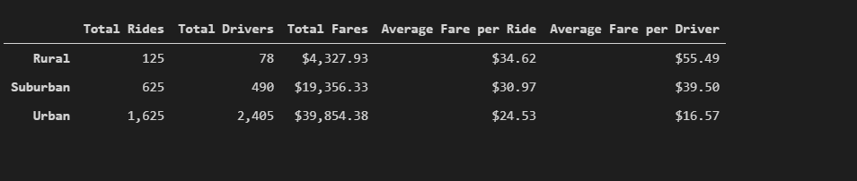
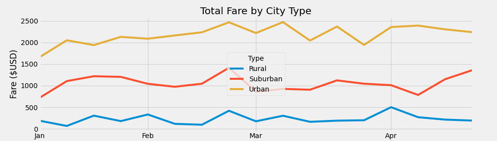

# PyBer_Analysis

# Overview
The purpose of this data analysis was performed for Pyber, a ride sharing service application. The
ride share data was analyzed to find metrics for rural, suburban, and urban cities.  Some of the metrics for the city types include: total rides, total drivers, total fares, average for fares per ride, average fares per drivers, and total fares. Dataframes and linecharts where generated to visually summarize these metrics.

#

# Results
The following metrics were extracted from the ride sharing data and categorized by city type:

- Total rides
    - Rural: 125         
    - Suburban: 625
    - Urban: 1,625
- Total drivers
    - Rural: 78         
    - Suburban: 490
    - Urban: 2,405  
- Average fare per ride
    - Rural: $34.62         
    - Suburban: $30.97
    - Urban: $24.53
- Average fare per driver
    - Rural: $55.49         
    - Suburban: $39.50
    - Urban: $16.57
- Total fares
    - Rural: $4,327.93         
    - Suburban: $19,356.33
    - Urban: $39,854.38

Image of dataframe provided below for categorized results by city types:

#

# Summary
In summary, there are two important disparities uncovered between the three city types. They are listed below followed by reccommendations to help.

- Desparity I
    - The ratio of total rides to total drivers: 
      - Reccomendation is to add more drivers to the rural and suburban cities
- Desparity II          
    - The average fare per driver
       - Recommendation is to reduce the amount of drivers in the urban city type

My closing reccommendation is to collect more data to help find the optimal ratio for total rides to total drivers and in average fare per driver. Working to achieve the similar ratios among all city types would help minimize the two noticeable disparities.  

Multiple linechart provided below:

 

#